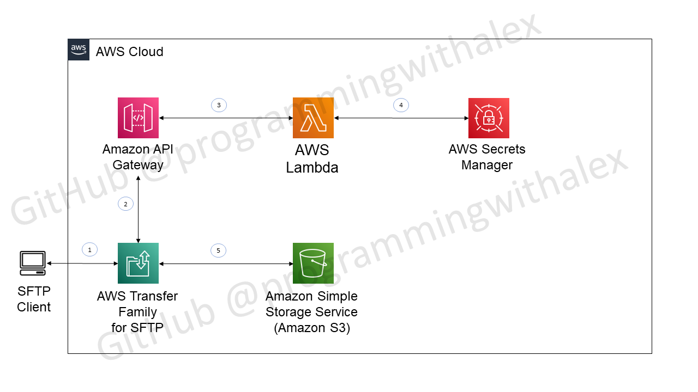

# sftp_server

Copyright (c) 2022, [GitHub@programmingwithalex](https://github.com/programmingwithalex)

---

## Series Outline

1. [Create SFTP server - SSH key authentication](https://docs.aws.amazon.com/transfer/latest/userguide/create-server-sftp.html)

2. [Create SFTP server - password authentication](https://aws.amazon.com/blogs/storage/enable-password-authentication-for-aws-transfer-for-sftp-using-aws-secrets-manager/)

3. [Create separate IAM base and admin user roles and policies](https://docs.aws.amazon.com/transfer/latest/userguide/requirements-roles.html)

     * base user will only be allowed to download from SFTP server
     * admin user will be allowed to download, upload, and delete from SFTP server

4. [Setup AWS web application firewall to restrict IP access on server-level](https://aws.amazon.com/blogs/storage/securing-aws-transfer-family-with-aws-web-application-firewall-and-amazon-api-gateway/)]

5. Resrict IP access at the user-level

## Create SFTP Server - SSH Key Authentication

* Connecting with SSH keys via WinSCP:
  * Public key pasting into AWS:
    * `ssh-rsa AAAAB3Nz...`
  * Load public key to be pasted by loading private key in puttygen
* When creating users on SFTP server on AWS:
  * Set both as `Restricted`
  * Set `admin` user `Home directory` to empty

## Create SFTP Server - Password Authentication

* Use `CloudFormation` script found on [AWS blogs](https://aws.amazon.com/blogs/storage/enable-password-authentication-for-aws-transfer-for-sftp-using-aws-secrets-manager/)
* Alternatively, use the same file downloaded locally in the repository with slight modifications to provide custom names for resources created
  * `aws_files\aws-transfer-custom-idp-secrets-manager-apig.template.yml`

## Create Separate IAM Base and Admin User Roles and Policies

* Reference `aws_files` folder for scripts necessary
  * `aws_files\iam_role_user_base.json`
    * role: `iam-role-sftp-user-base`
    * policy: `iam-policy-sftp-user-base`
  * `aws_files\iam_role_user_admin.json`
    * role: `iam-role-sftp-user-admin`
    * policy: `iam-policy-sftp-user-admin`

* Trust relationship must be updated for each role:
  * `aws_files\iam_role_user_trust_relationship.json`
    * Set on IAM > Role > Trust Relationships

* [Prevent directory traversing for users](https://docs.aws.amazon.com/transfer/latest/userguide/logical-dir-mappings.html)

  * Set `HomeDirectoryDetails` from `CloudFormation` script in `Secrets Manager` that is accessed in `lambda` function
  * Prevents traversing up directories if want to restrict to user folder
  * Hides top-folder name from user

## Resrict IP Access at the User-Level

* Access incoming IP from lambda function with `event['sourceIp']`

```python
def lambda_handler(event, context):
    source_ip = event['sourceIp']
```

---

## Possible Issues and Solutions

### Connecting to SFTP Server

* Make sure WinSCP > Advanced > Directories > Remote Directories
  * Set to empty

---



---

## License

[BSD 3-Clause License](https://github.com/programmingwithalex/aws_sftp_server/blob/main/LICENSE)
